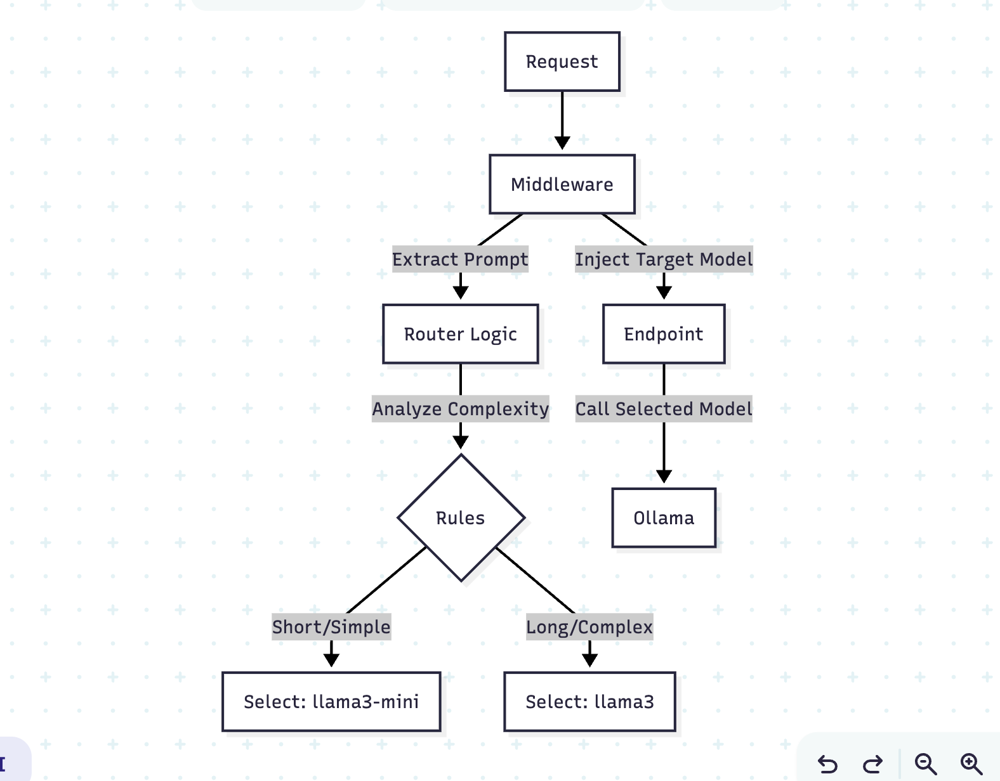
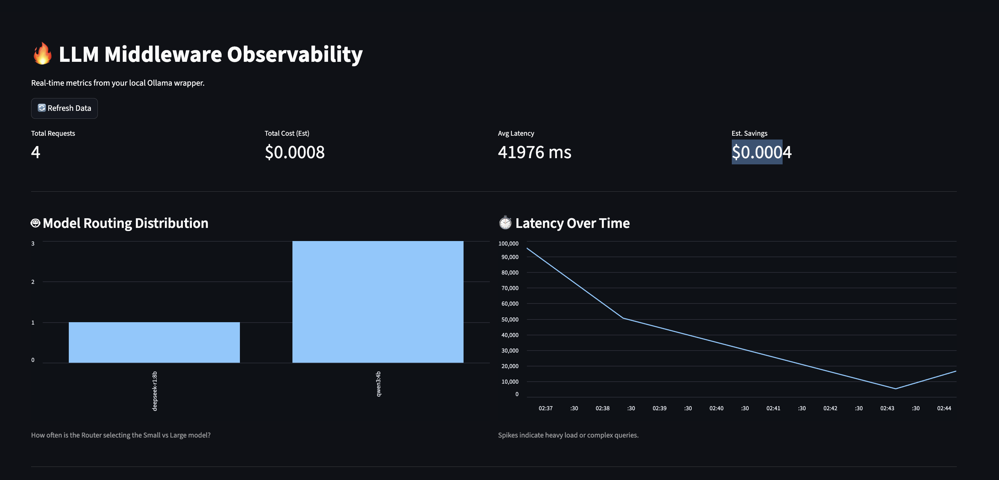

# Cost-Aware LLM Gateway

A robust, production-ready API gateway for LLMs (Ollama) that intelligently routes logs requests, tracks costs, and ensures resilience.

## Architecture



The system consists of:
1.  **FastAPI Gateway**: Handles incoming generation requests.
2.  **Middleware**: Intercepts requests, assigns unique IDs, and logs metrics.
3.  **Smart Router**: Analyzes prompt complexity to choose between "Cheaper/Faster" (e.g., Qwen) and "Smarter/Slower" (e.g., DeepSeek) models.
4.  **Resilience Layer**: Retries failed calls to the LLM backend using exponential backoff.
5.  **Dashboard**: A Streamlit app for real-time cost and latency observability.

## Features

- **Cost Tracking**: Estimates token usage and cost per request.
- **Intelligent Routing**: Dynamically selects models based on prompt complexity.
- **Resilience**: `tenacity`-based retries for network or server errors.
- **Observability**: JSONL file-based logging and a visual dashboard.
- **Production Ready**: configurable via environment variables.


## Installation

1.  Clone the repository.
2.  Install dependencies:
    ```bash
    pip install -r requirements.txt
    ```
3.  Ensure [Ollama](https://ollama.ai/) is running locally or configured via `OLLAMA_HOST`.

## Usage

### 1. Start the API Gateway
```bash
python main.py
```
The API will be available at `http://localhost:8000`.

### 2. Start the Dashboard
```bash
streamlit run dashboard.py
```
View the dashboard at `http://localhost:8501`.

## Configuration

- `OLLAMA_HOST`: URL of the Ollama server (default: `http://localhost:11434`)
- `LOG_FILE`: Path to the log file (default: `request_logs.jsonl`)

## API Endpoints

- `POST /generate`: Analyzes prompt, routes to appropriate model, and returns response.
    - Body: `{"prompt": "...", "model": "optional"}`
